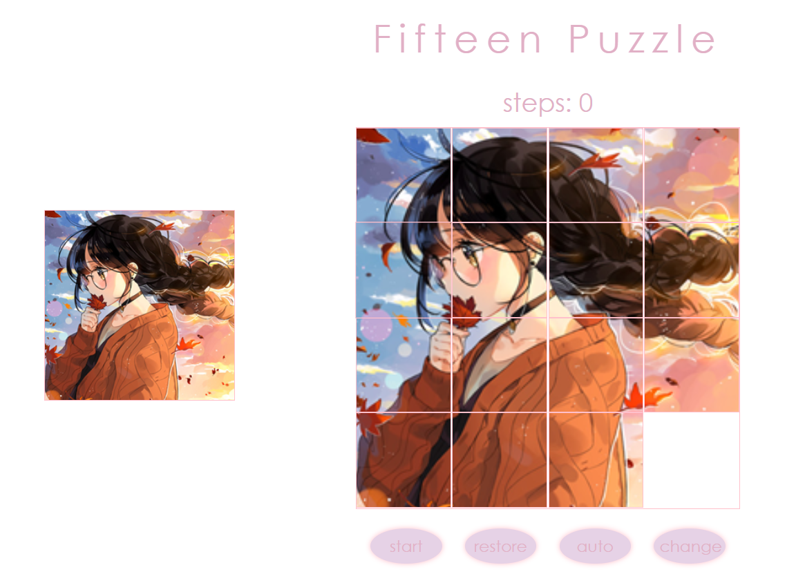

# Web-2.0
Materials and Homework of Web 2.0 course in SYSU

## 1. Recipe

## 2. Movie Review

## 3. Ring Menu

## 5. Calculator

## 6. Games(mole and mole)

## 7. Puzzle

## 8. signup&sign in

## 9. ring (Asynchronous JavaScript)

## 10. signin

